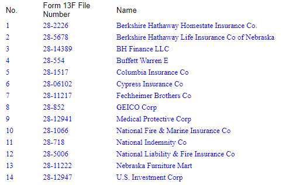

# finsec

## Download historical filing data directly from the United States (U.S.) Securities Exchange Commission (SEC).


<table border=1 cellpadding=10><tr><td>

#### <ins>**IMPORTANT LEGAL DISCLAIMER**</ins>
-----
**finsec** is **not** affiliated, endorsed, or vetted by the United. States. Securities Exchange Commission. It's an open-source tool that uses the SEC's publicly available APIs. This tool is intended for research and informational purposes only. It should not be used for making financial decisions. Always consult with a qualified financial advisor for investment guidance. 

**You should refer to SEC Edgar's website for more details ([here](https://www.sec.gov/os/accessing-edgar-data))**

</td></tr></table>

<a target="new" href="https://pypi.python.org/pypi/finsec"></a>
<a target="new" href="https://pypi.python.org/pypi/finsec"></a>
<a target="new" href="https://pypi.python.org/pypi/finsec"></a>
<a target="new" href="https://pypi.python.org/pypi/finsec"></a>
<a target="new" href="https://github.com/git-shogg/finsec"></a>
<!-- <a target="new" href="https://github.com/git-shogg/finsec/actions/workflows/ci/badge.svg"></a> -->
[](https://github.com/git-shogg/finsec/actions/workflows/ci.yml)
<!-- ## Blogs
Check out these blog posts for detailed tutorials with code examples:
</br >- [Medium 1]().</br >
</br >- [Medium 2]().</br >
</br >- [Medium 3]().</br > -->

## Quickstart
### Review 13F filings for Berkshire Hathaway CIK **0001067983**

```python
import finsec
filing = finsec.Filing('0001067983')

# Return the latest 13F reported holdings for Berkshire Hathaway.
print(filing.latest_13f_filing)
```
**Output:**
|    | Name of issuer          | Title of class   | CUSIP     | Share or principal type   |   Holding value |   Share or principal amount count |
|---:|:------------------------|:-----------------|:----------|:--------------------------|----------------:|----------------------------------:|
|  0 | ACTIVISION BLIZZARD INC | COM              | 00507V109 | SH                        |      4470946000 |                          60141866 |
|  1 | ALLY FINL INC           | COM              | 02005N100 | SH                        |       834901000 |                          30000000 |
|  2 | AMAZON COM INC          | COM              | 023135106 | SH                        |      1205258000 |                          10666000 |

*Note*: Using the `latest_13f_filing` function will return the the latest "simplified" version of the 13F Information Table, this works well in most instances... However, there are some who may want to have a more detailed breakdown of the filing. Such as, which investment manager was responsible for investing in the security and the voting authority type granted. This can be handled with the function `latest_13f_filing_detailed` (below).

```python
# Return the latest detailed 13F reported holdings for Berkshire Hathaway.
print(filing.latest_13f_filing_detailed)
```
**Output:**
|    | Name of issuer          | Title of class   | CUSIP     |   Holding value | Share or principal type   |   Share or principal amount count | Put or call   | Investment discretion   | Other manager   |   Voting authority sole count |   Voting authority shared count |   Voting authority none count |
|---:|:------------------------|:-----------------|:----------|----------------:|:--------------------------|----------------------------------:|:--------------|:------------------------|:----------------|------------------------------:|--------------------------------:|------------------------------:|
|  0 | ACTIVISION BLIZZARD INC | COM              | 00507V109 |      1906458000 | SH                        |                          25645116 |               | DFND                    | 4,8,11          |                      25645116 |                               0 |                             0 |
|  1 | ACTIVISION BLIZZARD INC | COM              | 00507V109 |        85095000 | SH                        |                           1144672 |               | DFND                    | 4,10            |                       1144672 |                               0 |                             0 |
|  2 | ACTIVISION BLIZZARD INC | COM              | 00507V109 |      2479393000 | SH                        |                          33352078 |               | DFND                    | 4,11            |                      33352078 |                               0 |                             0 |

```python
# Return the latest 13F cover page details for Berkshire Hathaway.
filing.latest_13f_filing_cover_page

#Output
{'filing_manager': 'Berkshire Hathaway Inc', 'business_address': '3555 Farnam Street, Omaha, NE, 68131', 'submission_type': '13F-HR', 'period_of_report': '09-30-2022', 'signature_name': 'Marc D. Hamburg', 'signature_title': 'Senior Vice President', 'signature_phone': '402-346-1400', 'signature_city': 'Omaha', 'signature_state': 'NE', 'signature_date': '11-14-2022', 'portfolio_value': 296096640000, 'count_holdings': 179}

# Return the attributes of a specific 13F filing for the specified cik. In the below example we are looking to grab the cover page, full holdings table and simplified holdings table for Berkshire for Q2-2022 (Calendar Year). 
q2_cover_page, q2_holdings_table, q2_simplified_holdings_table = filing.get_a_13f_filing("Q2-2022")
print(q2_cover_page)
print(q2_holdings_table)
print(q2_simplified_holdings_table)

# Return the json object containing all 13F filings that are stored as part of the filing object (note this includes everything we've searched for so far).
filing.filings

# Write filings to excel. Record everything we've looked at to Excel. 
filing.filings_to_excel
```

# Installation
Install `finsec` using `pip`:
``` {.sourceCode .bash}
$ pip install finsec
```

# Requirements
-   [Python](https://www.python.org) \>=  3.7+
-   [Pandas](https://github.com/pydata/pandas) \>= 1.3.5
-   [lxml](https://pypi.org/project/lxml) \>= 4.8.0
-   [requests](http://docs.python-requests.org/en/master) \>= 2.27.1
-   [beautifulsoup4](https://pypi.org/project/beautifulsoup4) \>= 4.11.1

*Note* that the above packages will be downloaded automatically using `pip`.

# Author
**Stephen Hogg**


<!-- ## Taxonomy
The [XBRL GAAP Financial Reporting Taxonomy](https://fasb.org/Page/PageContent?PageId=/xbrl/2022financial.html#:~:text=The%202022%20GAAP%20Financial%20Reporting%20Taxonomy%20) is kept up to date by the Financial Accounting Standards Board (FASB) and is used by issuers filing with the U.S. SEC. This taxonomy is levered heavily by finsec to ensure all filing details are captured in strict accordance with SEC rules.  -->

<!-- Explaining the 13F Information Table:

The 13F rule set is outlined herewithin:
https://www.sec.gov/pdf/form13f.pdf

Name of issuer


holdings_table

simplified_holdings_table
This table simplifies the holding table if required. This is particularly useful for businesses that have many different investment managers (e.g. Berkshire Hathaway - where they have 14 separate managers shown below)


 -->


<!-- Introduction

Are you looking for an efficient way to scrape data from the Securities and Exchange Commission (SEC)? If so, then you are in luck because I have recently developed a new Python library designed specifically for this purpose. This library, called SECScraper, is a powerful tool that makes it easy to scrape data from the SEC's website and use it for meaningful analysis.

What is SECScraper?

SECScraper is a Python library that allows developers to quickly and easily scrape data from the SEC's website. It can be used to retrieve information about companies, such as financial statements and filings, as well as more detailed information such as insider trades and ownership data. This library provides a simple interface for developers to access data from the SEC in a structured way, making it easy to work with the data for further analysis.

Features and Benefits

SECScraper is designed to make the process of scraping the SEC's website for data easier and more efficient. It provides a number of features and benefits to developers, including:

• Easy-to-use interface: SECScraper provides a simple, intuitive interface that makes scraping data from the SEC's website as easy as possible.

• Automated data extraction: SEC -->
